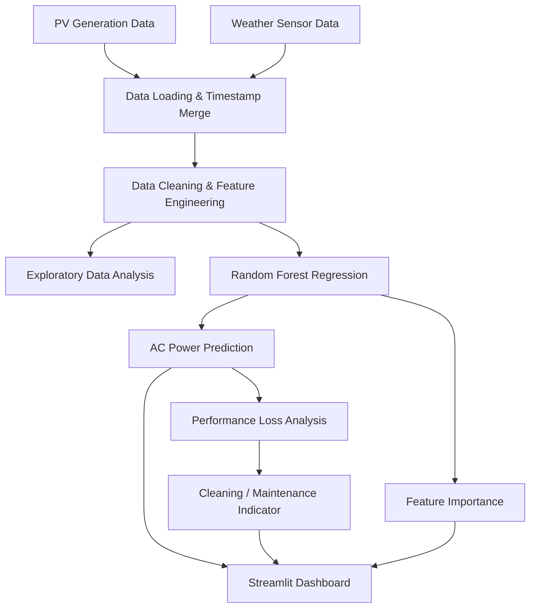

# Solar Energy Analytics & Predictive Maintenance Dashboard

A machine-learning-based solar PV analytics project for exploring power-generation patterns, predicting AC power output from environmental and temporal variables, and identifying potential panel-cleaning conditions through a rule-based performance-monitoring workflow.

## Overview

This project analyzes solar photovoltaic generation and weather-sensor data to understand how irradiation, temperature, and time-related variables relate to AC power generation.

A Random Forest regression model is used to predict AC power output. The project also includes feature-importance analysis and a rule-based cleaning/maintenance indicator based on predicted-versus-actual performance under sufficiently high irradiation.

A Streamlit dashboard provides an interactive interface for exploring the prediction results, entering operating conditions, viewing predicted power, checking the implemented maintenance status logic, and displaying selected analysis plots.

## Problem Statement

Solar PV output varies with environmental and operating conditions. Variations in irradiation and temperature can affect the amount of power produced by a PV system, while deviations between expected and observed output can indicate potential performance issues.

The objective is to build a data-driven workflow that:

- analyzes historical PV generation and weather data;
- predicts AC power output from available environmental and temporal features;
- identifies potential performance/cleaning cases using the implemented rule-based logic; and
- presents the analysis through an interactive dashboard.

## Objectives

- Merge solar generation and weather-sensor measurements using timestamp information.
- Perform exploratory analysis of solar power generation.
- Engineer time-based features from the timestamp.
- Train a Random Forest regression model for AC power prediction.
- Evaluate the model using Mean Absolute Error (MAE) and R².
- Analyze model feature importance.
- Detect potential cleaning requirements using the project's performance-loss rules.
- Provide an interactive Streamlit dashboard for prediction and visualization.

## Methodology

### 1. Data Loading and Integration

Generation and weather-sensor datasets are loaded and merged using timestamp information.

The project uses:

- Plant generation data
- Plant weather-sensor data

The timestamp is converted to a datetime representation and the two datasets are merged using an as-of timestamp join.

### 2. Exploratory Data Analysis

The project examines relationships between AC power and environmental variables through visualizations including:

- Solar power generation over time
- Irradiation versus AC power
- Module temperature versus AC power
- Average solar power generation by hour
- AC power distribution
- Correlation analysis

### 3. Feature Engineering

The timestamp is used to derive temporal features:

- Hour
- Day
- Month
- Minute

The final Random Forest experiment uses:

```text
IRRADIATION
AMBIENT_TEMPERATURE
MODULE_TEMPERATURE
hour
day
month
```

### 4. Solar Power Prediction

A Random Forest Regressor is trained to predict `AC_POWER`.

The final model configuration used in the project is:

```text
RandomForestRegressor(
    n_estimators=150,
    random_state=42
)
```

The data is divided using an 80/20 train-test split with `random_state=42`.

### 5. Performance Monitoring and Cleaning Detection

The project compares predicted power with observed AC power to identify potential performance loss.

The implemented cleaning-detection logic considers irradiation and the ratio between actual and predicted power. A potential cleaning case is flagged when the irradiation is sufficiently high and the efficiency ratio falls below the specified threshold.

This is a **rule-based indicator**, not a confirmed physical diagnosis of panel soiling.

### 6. Interactive Dashboard

The Streamlit application allows users to enter:

- Irradiation
- Ambient temperature
- Module temperature
- Hour
- Day
- Month

The trained model then predicts AC power and displays the implemented system-performance and maintenance-status indicators.

## System Architecture / Workflow



## Technologies Used

### Programming Language

- Python

### Data Analysis

- Pandas
- NumPy

### Machine Learning

- Scikit-learn
- Random Forest Regression

### Visualization

- Matplotlib
- Seaborn

### Dashboard

- Streamlit

### Model Persistence

- Joblib

### Development Environment

- Jupyter Notebook

## Dataset / Input Data

The project uses solar PV generation and weather-sensor data containing variables such as:

- Timestamp
- AC power
- Irradiation
- Ambient temperature
- Module temperature

The original project contains:

```text
Plant_1_Generation_Data.csv
Plant_1_Weather_Sensor_Data.csv
```

The raw datasets are not included in the cleaned portfolio repository by default. Obtain the source dataset from its original distribution/source and place the required files inside `data/`.

The repository intentionally avoids committing large datasets and generated artifacts.

## Results

The final Random Forest experiment was reproduced using the project's stated methodology:

- 150 trees
- `random_state=42`
- 80/20 train-test split
- Six input features

The merged dataset contained **68,778 records**, with **55,022 training samples** and **13,756 test samples**.

| Metric | Value |
|---|---:|
| Training samples | 55,022 |
| Test samples | 13,756 |
| Mean Absolute Error (MAE) | **16.3381** |
| R² Score | **0.9855** |

The model achieved an R² of **0.9855** on the held-out test set.

### Feature Importance

| Feature | Importance |
|---|---:|
| Irradiation | **0.995962** |
| Module Temperature | 0.001298 |
| Ambient Temperature | 0.001025 |
| Day | 0.000862 |
| Hour | 0.000774 |
| Month | 0.000079 |

Irradiation was overwhelmingly the dominant feature in this experiment, with an importance of approximately **0.996**.

> **Important:** The reported R² is a regression metric and should not be described as "98.55% accuracy." These results correspond to the project's random 80/20 train-test split and should not be interpreted as production forecasting performance.

## Key Findings

- Solar irradiation was the dominant predictor of AC power in the evaluated Random Forest model.
- The model produced a strong fit on the held-out test set under the project's random train-test split.
- Time-based features and temperature variables contributed substantially less feature importance than irradiation in this experiment.
- The project demonstrates how predicted-versus-observed power can be combined with operating conditions to create a simple performance-monitoring and cleaning indicator.

## Dashboard

The Streamlit dashboard provides:

- Interactive weather/operating-condition inputs
- Predicted AC power
- Expected-power comparison
- System-efficiency indicator
- Panel cleaning/maintenance status
- Daily prediction curve
- Model-analysis plots

Run the dashboard with:

```bash
streamlit run app.py
```

## How to Run

### 1. Clone the repository

```bash
git clone https://github.com/EshaSingh02/solar-energy-analytics.git
cd solar-energy-analytics
```

### 2. Create a virtual environment

macOS/Linux:

```bash
python -m venv .venv
source .venv/bin/activate
```

Windows:

```bash
python -m venv .venv
.venv\Scripts\activate
```

### 3. Install dependencies

```bash
pip install -r requirements.txt
```

### 4. Prepare the data

Place the required source CSV files in:

```text
data/
├── Plant_1_Generation_Data.csv
└── Plant_1_Weather_Sensor_Data.csv
```

### 5. Run the analysis notebook

```bash
jupyter notebook
```

Open:

```text
notebooks/solar_analysis.ipynb
```

Run the notebook to reproduce the data processing, analysis, model training, evaluation, and generated results.

### 6. Run the dashboard

After generating the trained model artifact:

```bash
streamlit run app.py
```

The dashboard expects the trained model at:

```text
results/solar_power_model.pkl
```

The generated prediction results can also be placed at:

```text
results/solar_prediction_results.csv
```

These generated files are intentionally excluded from version control by `.gitignore`.

## Project Structure

```text
solar-energy-analytics/
│
├── app.py
├── README.md
├── requirements.txt
├── .gitignore
├── LICENSE
│
├── data/
│   └── README.md
│
├── notebooks/
│   └── solar_analysis.ipynb
│
├── src/
│   ├── __init__.py
│   ├── data_loader.py
│   ├── feature_engineering.py
│   ├── model_training.py
│   └── cleaning_detection.py
│
└── results/
    ├── README.md
    ├── actual_vs_predicted_power.png
    ├── feature_importance.png
    ├── hourly_average_power.png
    ├── irradiation_vs_power.png
    ├── module_temperature_vs_power.png
    └── power_generation_over_time.png
```

## Limitations

- The final evaluation uses a random 80/20 train-test split rather than a chronological split.
- The model therefore does not establish real-world future forecasting performance.
- The cleaning/maintenance indicator is rule-based and should not be treated as a confirmed diagnosis of panel soiling or hardware failure.
- The model's strong dependence on irradiation means that its performance should be evaluated carefully under conditions different from the training data.
- Raw datasets and large generated model artifacts are excluded from the repository.

## Future Work

Potential improvements include:

- Use chronological/time-based validation for a more realistic forecasting evaluation.
- Evaluate the model across different inverters and operating periods.
- Compare Random Forest with other regression approaches.
- Develop a more robust anomaly-detection or predictive-maintenance model.
- Incorporate additional operational variables where available.
- Add automated model retraining and monitoring.
- Deploy the dashboard as a hosted application.

These are proposed improvements and are not claimed as completed work.

## References

The project is based on the solar PV generation and weather-sensor dataset used in the original analysis. Dataset attribution and access information should be added here once the exact source URL/licensing information is confirmed.

## Author

**Esha Singh**

M.Tech, Sustainable Energy Engineering  
Indian Institute of Technology Kanpur

GitHub: [EshaSingh02](https://github.com/EshaSingh02)
